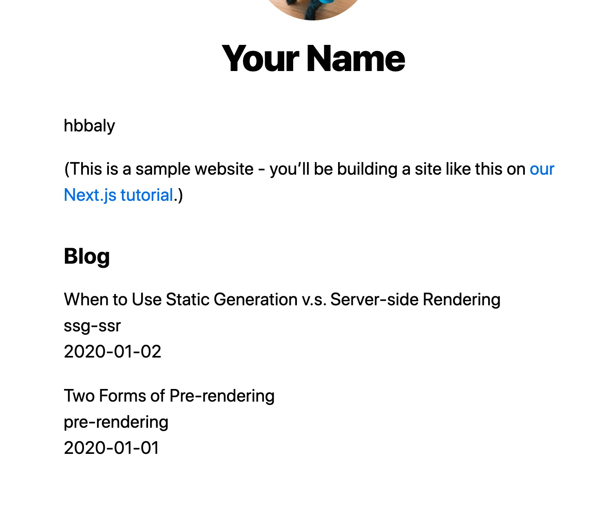

# 预渲染

`Next.js`默认情况下预渲染每一页。这意味着`Next.js`提前生成HTML的每一页，而不必一切由客户端`JavaScript`来完成。预渲染可能会导致更好的性能和搜索引擎优化。

## 静态页面 vs 服务端渲染

建议使用静态页面（有或无数据），因为你的页面可以一次建成并通过CDN，这使得它比无夫妻渲染页面渲染页面快得多。

如果页面频繁更新数据并且每次请求都会使页面的内容发生变化，这时使用服务端渲染， 可能会慢一些，但预渲染页面将始终保持最新。

## 静态页面示意图


## 服务端渲染示意图


## 客户端示意图


## getStaticProps

静态页面使用`getStaticProps`

在posts文件夹内新建`pre-rendering.md` 和 `ssg-ssr.md`

`pre-rendering.md`
```md
---
title: 'Two Forms of Pre-rendering'
date: '2020-01-01'
---

Next.js has two forms of pre-rendering: **Static Generation** and **Server-side Rendering**. The difference is in **when** it generates the HTML for a page.

- **Static Generation** is the pre-rendering method that generates the HTML at **build time**. The pre-rendered HTML is then _reused_ on each request.
- **Server-side Rendering** is the pre-rendering method that generates the HTML on **each request**.

Importantly, Next.js lets you **choose** which pre-rendering form to use for each page. You can create a "hybrid" Next.js app by using Static Generation for most pages and using Server-side Rendering for others.
```

`ssg-ssr.md`

```md
---
title: 'When to Use Static Generation v.s. Server-side Rendering'
date: '2020-01-02'
---

We recommend using **Static Generation** (with and without data) whenever possible because your page can be built once and served by CDN, which makes it much faster than having a server render the page on every request.

You can use Static Generation for many types of pages, including:

- Marketing pages
- Blog posts
- E-commerce product listings
- Help and documentation

You should ask yourself: "Can I pre-render this page **ahead** of a user's request?" If the answer is yes, then you should choose Static Generation.

On the other hand, Static Generation is **not** a good idea if you cannot pre-render a page ahead of a user's request. Maybe your page shows frequently updated data, and the page content changes on every request.

In that case, you can use **Server-Side Rendering**. It will be slower, but the pre-rendered page will always be up-to-date. Or you can skip pre-rendering and use client-side JavaScript to populate data.
```

```bash
npm install gray-matter
```

安装`gray-matter` 用来解析markdown文件

新建`lib/posts.js`

```js
import fs from 'fs'
import path from 'path'
import matter from 'gray-matter'

const postsDirectory = path.join(process.cwd(), '/pages/posts')  // 根据具体情况而定

export function getSortedPostsData() {
  // Get file names under /posts
  const fileNames = fs.readdirSync(postsDirectory)
  const allPostsData = fileNames.map(fileName => {
    // Remove ".md" from file name to get id
    const id = fileName.replace(/\.md$/, '')

    // Read markdown file as string
    const fullPath = path.join(postsDirectory, fileName)
    const fileContents = fs.readFileSync(fullPath, 'utf8')

    // Use gray-matter to parse the post metadata section
    const matterResult = matter(fileContents)

    // Combine the data with the id
    return {
      id,
      ...matterResult.data
    }
  })
  // Sort posts by date
  return allPostsData.sort((a, b) => {
    if (a.date < b.date) {
      return 1
    } else {
      return -1
    }
  })
}
```

提取markdown文件信息

`pages/index.js`引入

```js
import { getSortedPostsData } from './lib/posts'
//......
export async function getStaticProps() {
  const allPostsData = getSortedPostsData()
  return {
    props: {
      allPostsData
    }
  }
}
export default function Home({allPostsData}){
  return (
    <Layout home>
      <Head>
        <title>{siteTitle}</title>
      </Head>
      <section className={utilStyles.headingMd}>......</section>
      <section className={`${utilStyles.headingMd} ${utilStyles.padding1px}`}>
          <h2 className={utilStyles.headingLg}>Blog</h2>
          <ul className={utilStyles.list}>
            {allPostsData.map(({ id, date, title }) => (
              <li className={utilStyles.listItem} key={id}>
                {title}
                <br />
                {id}
                <br />
                {date}
              </li>
            ))}
          </ul>
        </section>
    </Layout>
  )
}
```

可以看到



[getStaticProps API](https://nextjs.org/docs/basic-features/data-fetching)

上例中我们从文件系统中获取数据， 如果获取外部数据呢？

```js
import fetch from 'node-fetch'

export async function getSortedPostsData() {
  // Instead of the file system,
  // fetch post data from an external API endpoint
  const res = await fetch('..')
  return res.json()
}
```

:::tip
在开发环境，`getStaticProps`每次请求运行。
在生产中，`getStaticProps`在生成时运行。

`getStaticProps`只能从一个页面导出。您不能从非页文件导出。
:::