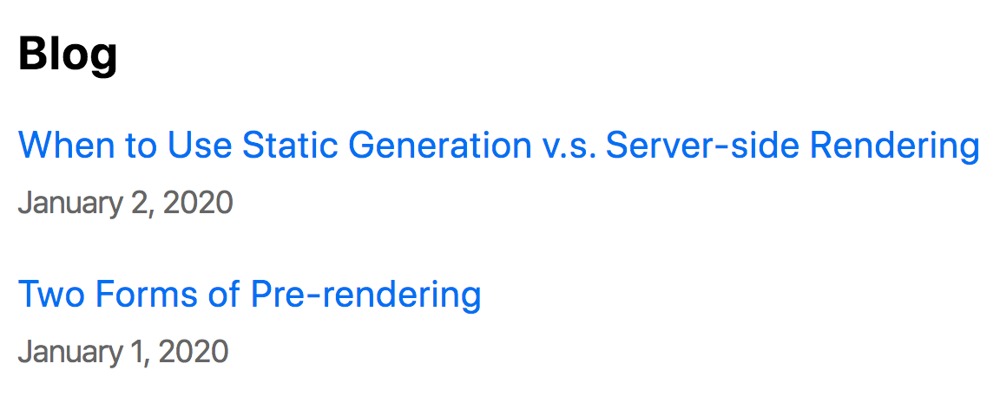

# 完善页面

## 时间格式

```bash
npm install date-fns
```

新建`components/date.js`

```js
import { parseISO, format } from 'date-fns'

export default function Date({ dateString }) {
  const date = parseISO(dateString)
  return <time dateTime={dateString}>{format(date, 'LLLL d, yyyy')}</time>
}
```

`[id].js`中使用

```jsx
import Layout from '../components/layout'
import {getAllPostIds, getPostData} from '../lib/posts'
import Date from '../components/date'
import Head from 'next/head'
import utilStyles from '../common/css/utils.module.css'
export default function Post({ postData }) {
  return (
    <Layout>
      <Head>
        <title>{postData.title}</title>
      </Head>
      <article>
        <h1 className={utilStyles.headingXl}>{postData.title}</h1>
        <div className={utilStyles.lightText}>
          <Date dateString={postData.date} />
        </div>
        <div dangerouslySetInnerHTML={{ __html: postData.contentHtml }} />
      </article>
    </Layout>
  )
}

export async function getStaticPaths() {
  // Return a list of possible value for id
  const paths = getAllPostIds()
  return {
    paths,
    fallback: false
  }
}

export async function getStaticProps({ params }) {
  // Fetch necessary data for the blog post using params.id
  const postData = await getPostData(params.id)
  return {
    props: {
      postData
    }
  }
}
```

## 完善index

`pages/index.js`

```js
import Link from 'next/link'
import Date from './components/date'
// ...... 
<li className={utilStyles.listItem} key={id}>
  <Link href="/posts/[id]" as={`/posts/${id}`}>
    <a>{title}</a>
  </Link>
  <br />
  <small className={utilStyles.lightText}>
    <Date dateString={date} />
  </small>
</li>
// ......
```



## 404页面添加

在`pages`新建`404.js`

```js
export default function Custom404() {
  return <h1>404 - Page Not Found</h1>
}
```

当找不到路由时就会使用新建的页面。

:::tip
这里大概是基础的`next.js`入门知识， 按照[官网](https://nextjs.org/learn/basics/create-nextjs-app)案例文档，一步步翻译写的。后续会写`next.js`进阶的东西。
:::