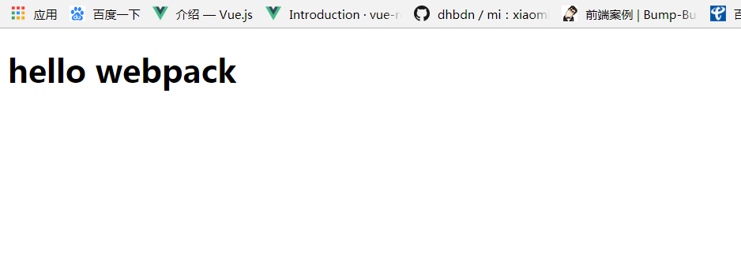

# webpack

::: tip
以webpack3.6.0版本为例

[查看源代码](https://github.com/hbbaly/webpack-)
:::

## 安装

使用webpack必须安装node

```js
  npm install -g webpack@3.6.0
  mkdir demo1  // 新建文件夹
  cd demo1
  npm init //初始化项目.
  npm install -D webpack@3.6.0    //安装局部webpack
```

## hello webpack

在`demo1`的文件夹内新建两个文件夹，`src`与`dist`

`src`文件夹：用来存放我们编写的javascript代码，可以简单的理解为用JavaScript编写的模块。

`dist`文件夹：用来存放供浏览器读取的文件，这个是webpack打包成的文件。

在dist下新建index.html文件,并写入如下代码：

```html
  <!DOCTYPE html>
  <html lang="en">
  <head>
      <meta charset="UTF-8">
      <meta name="viewport" content="width=device-width, initial-scale=1.0">
      <meta http-equiv="X-UA-Compatible" content="ie=edge">
      <title>Document</title>
  </head>
  <body>
      <script src="bundle.js"></script>v
  </body>
  </html>
```

在src内新建一个main.js文件。

```js
  document.write("<h1>hello webpack</h1>")
```

命令行输入

```
  webpacck src/main.js dist/bundle.js
```



## webpack.config

webpack.config.js 是webpack的配置文件

根目录下新建webpack.config.js文件

```js
  module.exports = {
    entry:"",  // 打包的入口文件，一个字符串或者一个对象。
    output:{  // 配置打包的结果，一个对象
        path:"",   //定义输出文件路径  ，一个字符串。
        filename:""    // 定义输出文件名，一个字符串。
    },
    module:{  //配置打包的结果，一个对象。
         // babel-loader(用来做js代码转化)
         // style-loader & css-loader(用来转化css代码)
        // less-loader 转化less文件
        // raw-loader 把文件当做普通的文本文件读取
       // json-loader webpack 2以后就不需要配置了（内置了）
      // file-loader 用来处理文件，可以用url-loader代替，但是如果你资源文件是即时文件，那么就使用fileload 指定一类对象作为文件，并且返回一个public 的url，这样可以利用浏览器的线程来加载文件，减小bundle.js的大小。
     // url-loader 用来处理eot|woff|woff2|ttf|svg|png|jpg这些文件，可以防止加载资源文件导致页面加载缓慢url-loader 使用limit来指定一个size，当文件的大小小于这个size的时候，对象将会转化为Dataurl，直接嵌入在js中.
       rules:[  //定义一系列的加载器，一个数组
            {
                test:  //正则表达式，用于匹配到的文件。
                loader/loaders:  //字符串或者数组，处理匹配到的文件。
                include:  //字符串或者数组，指包含的文件夹
    　　　　　　 exclude： //字符串或者数组，指排除的文件夹
            }
        ],
    }  ,
    plugins:[  //定义插件，一个数组
    ],
    devServer:{}  //配置webpack开发服务功能。
}
```

### entry

1. 当entry为字符串时候，表示需要打包的路径，并且只有一个文件需要打包。

2.当为对象时候：

  - 为数组：表示当需要将多个模块打包成一个模块。['main.js','index.js']

  - 为json时候：需要分别打包成多个模块时：

```js
entry:{
  bundle1:"main1.js",
  bundle2:"main2.js"
}
```

### output

output.filename:指定输出文件名，一个字符串。

当输出多个文件，output.filename不能为一个确定的字符串。为了让每个文件有一个唯一的名字，需要用到变量[name]，对应entry的键名。

output.path:指定输出文件的路径，相对路径，一个字符串。

```js
const path = require("path")
module.exports = {
    entry: {
        bundle: "./src/main.js",
        bundle1: "./src/main1.js"
    },
    output: {
        path: path.resolve(__dirname, 'dist'),
        filename: '[name].js'
    }
}
```

对应的html也要改为：
```html
<!DOCTYPE html>
<html lang="en">
<head>
    <meta charset="UTF-8">
    <meta name="viewport" content="width=device-width, initial-scale=1.0">
    <meta http-equiv="X-UA-Compatible" content="ie=edge">
    <title>Document</title>
</head>
<body>
    <script src="bundle.js"></script>
    <script src="bundle1.js"></script>
</body>
</html>
```

## html处理

```
  npm install -D html-webpack-plugin
```

在webpack.config.js内引入html-webpack-plugin

```js
var htmlPlugin = require('html-webpack-plugin')
```

在plugins内配置插件：
```js
new htmlPlugin({
  minify:{
    removeAttributeQuotes:true
  },
  hash:true,
  template:'./src/index.html'
 })
```

- minify：是对html文件进行压缩，removeAttrubuteQuotes是却掉属性的双引号。
- hash：为了开发中js有缓存效果，所以加入hash，这样可以有效避免缓存JS。
- template：是要打包的html模版路径和文件名称。

## css支持

在src文件夹下新建css文件夹，在css文件夹内新建main.css文件，编写：

```css
body{
     background:yellow;
}
```

在main.js文件内引入main.css

```js
require("./css/main.css")
document.write("<h1>hello webpack</h1>")
```

安装css-loader与style-loader

```
npm install -D css-loader style-loader
```
修改webpack.config.js中module属性中的配置：

```js
module:{
  rules:[
    {
      test:/\.css$/,
      use:['style-loader','css-loader']
    }
  ]
}
```

## js压缩

webpack.config.js文件中引入uglifyjs插件（虽然uglifyjs是插件，但是webpack版本里默认已经集成，不需要再次安装。）

```
const uglify = require('uglifyjs-webpack-plugin')
```

引入后在plugins配置里new一个 uglify对象就可以了

```
new uglify()
```

## css分离

安装插件`extract-text-webpack-plugin`插件

```
npm install -D extract-text-webpack-plugin
```

在webpack.config.js中引入此插件,并进行相关配置：

```js
const extractText = require('extract-text-webpack-plugin')

///////module中关于style-loader与css-loader代码
{
  test:/\.css$/,
  use:extractText.extract({
  fallback:'style-loader',
  use:'css-loader'
  })
}
```
## css3前缀

安装postcss-loader与autoprefixer

```
npm install -D postcss-loader autoprefixer
```
在与webpack.config.js同级下新建一个postcss.config.js文件，并配置此文件

```js
module.exports = {
  plugins:[
    require('autoprefixer')
  ]
}
```
在webpack.config.js中修改配置

```js
{
  test: /\.css$/,
  use: extractTextPlugin.extract({
    fallback: 'style-loader',
    use: [
      { loader: 'css-loader', options: { importLoaders: 1 } },
    'postcss-loader'
    ]
  })
}
```
## 消除未使用的css

安装PurifyCSS-webpack

```
npm install -D purifycss-webpack purify-css
```

引入glob与purifycss-webpack

```js
const glob = require("glob")
const purifyCSS = require("purifycss-webpack")
```
配置webpack.config.js中plugins选项

```js
new purifyCSS({
  paths:glob.sync(path.join(__dirname,'src/*.html'))
})
```

## 图片路径处理

有可能css内的图片路径不对，导致图片不能显示，可以使用 `publicPath`来解决。
```js
const public = {
  publicPath:'http://ip:port/'
}
// 这里的ip和port，是你本机的ip或者是你devServer配置的ip和端口
output:{
  path:path.resolve(__dirname,'dist'),
  filename:'bundle.js',
  publicPath:public.publicPath
},
```

处理html中图片，使用html-withimg-loader插件来处理
```
npm install -D html-withimg-loader
```

配置loader
```js
{
  test:/\.(htm|html)$/i,
  use:['html-withimg-loader']
}
```

## less处理

安装less，less-loader
```js
npm install -D less less-loader
```
编写loader配置
```js
{
  test:/\.less$/,
  use:extractText.extract({
    use:[
      {loader:'css-loader'},
      {loader:'less-loader'}
    ],
    fallback:'style-loader'
  })
}
```

## sass处理

```
npm install -D node-sass sass-loader
```
编写loader配置

```js
{
  test:/\.sass$/,
  use:extractText.extract({
    use:[
      {loader:'css-loader'},
      {loader:'sass-loader'}
    ],
    fallback:'style-loader'
  })
}
```

## babel支持

```
npm i -D babel-core babel-loader babel-preset-env
```

webpack.config.js配置

```js
{
  test:/\.js$/,
  use:{loader:'babel-loader'},
  exclude:/node_modules/
}
```

在根目录下新建一个.babelrc文件

```js
{
    "presets":["env"]
}
```